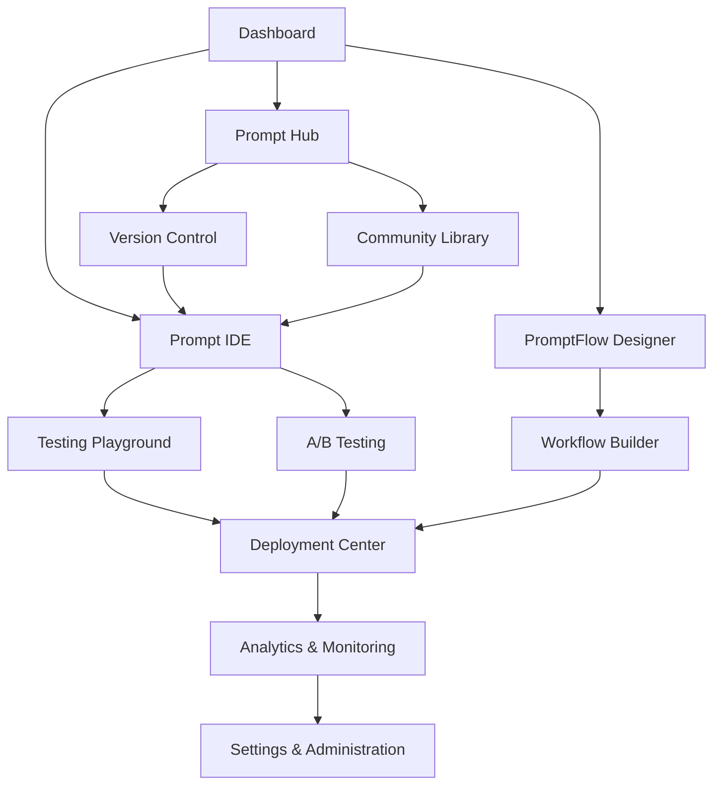

# PigeonPrompt Platform - Product Requirements Document

## 1. Product Overview

PigeonPrompt is a professional-grade, multi-tenant SaaS platform designed to revolutionize how individuals and teams create, test, version, collaborate on, deploy, and monitor AI prompts. The platform serves as the definitive tool for prompt engineering operations, combining sophisticated IDE capabilities with enterprise-grade collaboration and deployment features.

The platform addresses the critical gap in the AI development workflow where prompt engineering lacks proper tooling, version control, and operational oversight. PigeonPrompt empowers users to master the art and science of prompt engineering through intelligent automation and seamless workflows.

Target market value: $2.5B+ prompt engineering and AI operations market, targeting individual AI practitioners, development teams, and enterprise organizations adopting AI at scale.

## 2. Core Features

### 2.1 User Roles

| Role | Registration Method | Core Permissions |
|------|---------------------|------------------|
| Individual User | Email/Social login | Private workspace access, community library browsing, basic prompt management |
| Team Member | Team invitation | Shared workspace collaboration, advanced versioning, team prompt libraries |
| Team Admin | Team creation/upgrade | Full team management, workspace administration, billing control |
| Enterprise User | SSO/Custom auth | Advanced analytics, compliance features, dedicated support |

### 2.2 Feature Module

Our PigeonPrompt platform consists of the following main pages:

1. **Dashboard**: Workspace overview, recent prompts, performance metrics, quick actions
2. **Prompt IDE**: Advanced editor with syntax highlighting, templating, real-time testing playground
3. **Prompt Hub**: Central repository with version control, project organization, search and discovery
4. **PromptFlow Designer**: Visual workflow builder for chaining prompts into complex operations
5. **Analytics & Monitoring**: Performance dashboards, cost tracking, prompt drift detection
6. **Deployment Center**: API endpoint management, production monitoring, scaling controls
7. **Settings & Administration**: User management, workspace configuration, billing and subscription

### 2.3 Page Details

| Page Name | Module Name | Feature description |
|-----------|-------------|---------------------|
| Dashboard | Workspace Overview | Display recent prompts, performance summaries, team activity feeds |
| Dashboard | Quick Actions | Create new prompt, import from community, access recent projects |
| Dashboard | Performance Metrics | Real-time cost tracking, usage analytics, success rate indicators |
| Prompt IDE | Advanced Editor | Monospaced editor with syntax highlighting, Jinja2 templating support, auto-completion |
| Prompt IDE | Testing Playground | Multi-model comparison, side-by-side output analysis, latency and cost tracking |
| Prompt IDE | A/B Testing Suite | Automated prompt variation testing, success criteria evaluation, statistical analysis |
| Prompt IDE | AI-Powered Linter | Real-time prompt analysis, optimization suggestions, bias detection |
| Prompt Hub | Version Control | Git-like branching, commit history, merge workflows, pull request system |
| Prompt Hub | Project Organization | Folder structure, tagging system, advanced search, filtering capabilities |
| Prompt Hub | Collaboration Tools | Team sharing, permission management, comment system, review workflows |
| Prompt Hub | Community Library | Public prompt discovery, import functionality, rating and review system |
| PromptFlow Designer | Visual Workflow Builder | Drag-and-drop interface, node-based prompt chaining, logical operators |
| PromptFlow Designer | Flow Testing | End-to-end workflow validation, debugging tools, performance optimization |
| PromptFlow Designer | Template Library | Pre-built workflow templates, custom node creation, flow sharing |
| Analytics & Monitoring | Performance Dashboards | Real-time metrics, historical trends, comparative analysis |
| Analytics & Monitoring | Cost Management | Token usage tracking, model cost comparison, budget alerts |
| Analytics & Monitoring | Quality Monitoring | Output quality metrics, prompt drift detection, anomaly alerts |
| Deployment Center | API Management | Endpoint creation, versioning, authentication, rate limiting |
| Deployment Center | Production Monitoring | Uptime tracking, error logging, performance metrics, scaling controls |
| Deployment Center | Security & Compliance | Access controls, audit logging, data encryption, compliance reporting |
| Settings & Administration | User Management | Team member administration, role assignment, access control |
| Settings & Administration | Workspace Configuration | Environment settings, integration management, custom branding |
| Settings & Administration | Billing & Subscription | Plan management, usage tracking, payment processing, invoice generation |

## 3. Core Process

**Individual User Flow:**
Users begin by creating prompts in the IDE, testing them against multiple AI models, iterating based on results, organizing prompts in the Hub with version control, and optionally deploying successful prompts as API endpoints.

**Team Collaboration Flow:**
Team members create prompts collaboratively, use pull request workflows for review and approval, maintain shared prompt libraries, coordinate through team workspaces, and deploy enterprise-grade solutions with monitoring.

**Enterprise Operations Flow:**
Enterprise users leverage advanced analytics for prompt performance optimization, implement compliance and security controls, scale deployments across multiple environments, and maintain operational oversight through comprehensive monitoring.

## 4. User Interface Design

### 4.1 Design Style

- **Primary Colors**: Deep blue (#1e40af) for trust and professionalism, vibrant green (#10b981) for success states
- **Secondary Colors**: Warm gray (#6b7280) for neutral elements, amber (#f59e0b) for warnings
- **Button Style**: Rounded corners (8px radius), subtle shadows, hover state animations
- **Typography**: Inter font family, 14px base size, clear hierarchy with 16px/20px/24px headings
- **Layout Style**: Clean card-based design, left sidebar navigation, generous whitespace
- **Icons**: Lucide icon set for consistency, 16px/20px/24px sizes, outlined style

### 4.2 Page Design Overview

| Page Name | Module Name | UI Elements |
|-----------|-------------|-------------|
| Dashboard | Workspace Overview | Grid layout with metric cards, recent activity timeline, progress indicators |
| Dashboard | Quick Actions | Prominent CTA buttons, search bar, floating action button for new prompts |
| Prompt IDE | Advanced Editor | Full-height code editor, collapsible sidebar, tabbed interface for multiple prompts |
| Prompt IDE | Testing Playground | Split-pane layout, model selection dropdown, real-time output comparison |
| Prompt Hub | Version Control | Tree view for branches, commit timeline, diff visualization, merge conflict resolution |
| Prompt Hub | Project Organization | File explorer interface, drag-and-drop functionality, breadcrumb navigation |
| PromptFlow Designer | Visual Builder | Canvas with zoom controls, node palette, connection indicators, minimap |
| Analytics & Monitoring | Dashboards | Chart.js visualizations, filterable date ranges, exportable reports |
| Deployment Center | API Management | REST endpoint documentation, code examples, testing interface |
| Settings & Administration | Configuration | Form-based settings, toggle switches, progressive disclosure |

### 4.3 Responsiveness

Desktop-first responsive design with mobile-adaptive layouts. Touch interaction optimization for tablet users, with gesture support for common actions like swipe navigation and pinch-to-zoom in the visual workflow