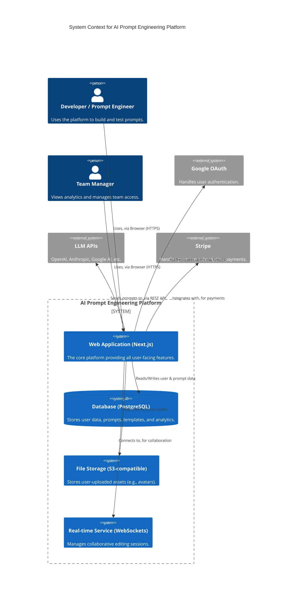
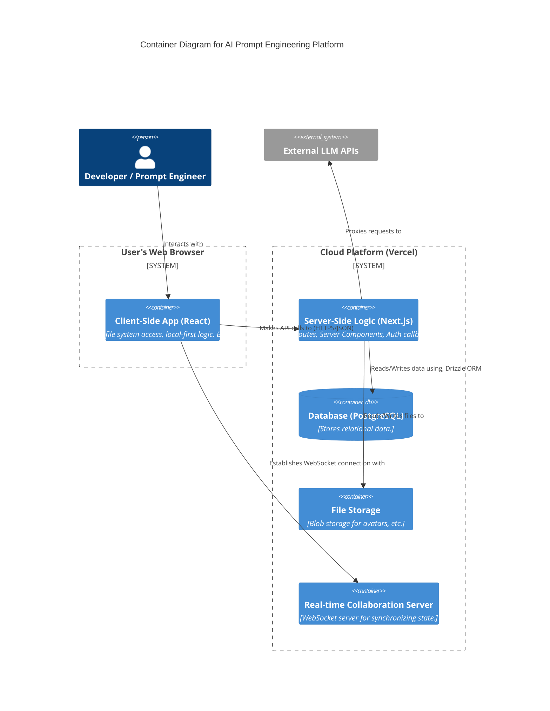

**Technical Architecture Document: AI Prompt Engineering Platform**

**Version:** 1.0
**Status:** For Implementation
**Author:** SaaS Architect Pro

**1. Executive Summary**

This document specifies the technical architecture for the AI Prompt
Engineering Platform. The architecture is designed as a **cloud-native,
serverless-first, monolithic application with a clear path to future
microservice extraction**. This approach balances rapid initial
development velocity with long-term scalability and maintainability.

The core of the system is a **Next.js 14 application** utilizing the App
Router. This choice unifies the frontend, backend (API routes), and
server-side rendering into a single, cohesive codebase, ideal for an
AI-driven development workflow. Security is paramount, with
a **local-first paradigm** for handling user files and a robust
authentication/authorization system.

The architecture is explicitly designed to support the entire product
roadmap, from the initial MVP to advanced features like real-time
collaboration and public APIs.

**2. Architectural Principles & Goals**

- **Developer Velocity:** Optimize for a fast, iterative development
  cycle, leveraging a unified stack (TypeScript everywhere) and modern
  frameworks.

- **Security by Design:** Prioritize user data privacy with a
  client-side-first approach for file handling and robust server-side
  security measures.

- **Scalability & Cost-Effectiveness:** Utilize serverless
  infrastructure that scales automatically with demand and minimizes
  idle costs.

- **Future-Proofing:** Make architectural choices that support the
  long-term vision (e.g., real-time collaboration, API integrations)
  from day one.

- **AI-Development Ready:** Provide clear, structured specifications
  (data models, API contracts) that can be used as direct inputs for AI
  coding assistants.

**3. System Architecture**

**3.1. High-Level Architecture Diagram (C4 Model - Level 1 & 2)**


**3.2. Container Diagram (C4 Model - Level 2 Decomposed)**


**3.3. Architectural Pattern: Serverless Monolith**

- **MVP (Phase 1):**
  The system operates as a
  **monolith**
  built on
  Next.js. The frontend (React components) and backend (API routes) live
  in the same repository and are deployed as a single unit. This
  maximizes development speed and simplifies initial deployment.

- **Post-MVP (Phase 2 & 3):** The architecture is designed
  for **graceful decomposition**.

  - **Real-time Collaboration:** This will be implemented as a separate
    WebSocket service (e.g., using PartyKit or a managed service like
    Liveblocks) that the Next.js application communicates with.

  - **Public API:** This can be built using Next.js API routes
    initially, but as it grows, it can be extracted into a separate,
    dedicated service behind an API Gateway for better security and
    management.

**4. Technology Stack**

  ----------------------------------------------------------------------------
  **Category**         **Technology**    **Rationale**
  -------------------- ----------------- -------------------------------------
  **Frontend &         **Next.js 14 (App A full-stack React framework. Unifies
  Backend**            Router)**         frontend/backend, enables server
                                         components for performance, and
                                         simplifies routing. Ideal for
                                         AI-driven development.

                       **React 18**      Industry-standard component library
                                         with concurrent features for a
                                         modern, responsive UI.

                       **TypeScript**    End-to-end type safety, reducing bugs
                                         and providing excellent
                                         autocompletion for developers and AI
                                         assistants.

  **Styling**          **Tailwind CSS**  A utility-first CSS framework for
                                         rapid, consistent UI development.

                       **Shadcn/ui**     A library of beautifully designed,
                                         accessible, and unstyled components
                                         that can be easily customized.

  **Database**         **PostgreSQL (via A powerful, reliable, and scalable
                       Neon)**           open-source relational database. Neon
                                         provides a serverless platform for
                                         it, with branching for dev/staging
                                         environments.

                       **Drizzle ORM**   A modern, lightweight, and type-safe
                                         TypeScript ORM. Its SQL-like syntax
                                         is intuitive, and its schema-first
                                         approach is perfect for AI-driven
                                         development.

  **Authentication**   **NextAuth.js     The de-facto standard for
                       (Auth.js v5)**    authentication in Next.js. Simplifies
                                         complex OAuth flows and provides
                                         secure session management out of the
                                         box.

  **Real-time Collab** **Liveblocks /    Managed services that handle the
                       PartyKit**        complexity of WebSockets, presence,
                                         and Conflict-free Replicated Data
                                         Types (CRDTs), significantly
                                         accelerating the development of
                                         collaborative features.

  **File Storage**     **S3-compatible   Reliable, scalable, and
                       (e.g., Cloudflare cost-effective object storage for
                       R2, Vercel        user-uploaded assets like avatars.
                       Blob)**           

  **Deployment &       **Vercel**        A zero-configuration platform built
  Infra**                                for Next.js. Provides hosting, CI/CD,
                                         serverless functions, a global edge
                                         network, and managed infrastructure
                                         services.

  **Testing**          **Vitest & React  For fast and effective unit and
                       Testing Library** component testing.

                       **Playwright**    For robust, reliable end-to-end
                                         testing that simulates real user
                                         interactions across different
                                         browsers.
  ----------------------------------------------------------------------------

**5. Data Architecture**

**5.1. Data Models (High-Level ERD)**

```mermaid
erDiagram
    USERS {
        UUID id PK
        TEXT email UNIQUE
        TEXT name
        TEXT avatar_url
        INT reputation
        BOOL is_trusted
        user_tier_enum subscription_tier
    }

    WORKSPACES {
        UUID id PK
        TEXT name
    }

    WORKSPACE_MEMBERS {
        UUID workspace_id FK
        UUID user_id FK
        member_role_enum role
    }

    PROMPT_TEMPLATES {
        UUID id PK
        UUID user_id FK "nullable for system templates"
        UUID workspace_id FK "nullable for personal templates"
        TEXT name
        TEXT description
        TEXT system_prompt
        TEXT user_prompt_template
        JSONB variables
        TEXT[] tags
    }

    PROMPT_RUN_HISTORY {
        UUID id PK
        UUID user_id FK
        UUID workspace_id FK
        TEXT model_used
        INT input_tokens
        INT output_tokens
        DECIMAL estimated_cost
        JSONB context_snapshot "Metadata of files used"
        TEXT full_prompt
        TEXT full_output
        TIMESTAMP created_at
    }

    COMMUNITY_PROMPTS {
        UUID id PK
        TEXT title
        TEXT prompt_text
        TEXT description
        JSONB example_outputs
        UUID author_id FK
        prompt_status_enum status
        FLOAT avg_rating
        INT usage_count
    }

    USERS ||--o{ WORKSPACE_MEMBERS : "is member of"
    WORKSPACES ||--o{ WORKSPACE_MEMBERS : "has member"
    WORKSPACES ||--o{ PROMPT_TEMPLATES : "contains"
    USERS ||--o{ PROMPT_TEMPLATES : "creates personal"
    USERS ||--o{ PROMPT_RUN_HISTORY : "executes"
    WORKSPACES ||--o{ PROMPT_RUN_HISTORY : "is executed in"
    USERS ||--o{ COMMUNITY_PROMPTS : "authors"

```
Note: This is a simplified model. Additional tables for ratings, comments, API keys, etc., will be required.

**5.2. Data Flow & Storage**

- **Client-Side Data:**
  User's local file tree, file content, and
  context builder state are managed
  exclusively in the browser's
  memory and IndexedDB**. This data never touches the server unless a
  prompt is executed.

- **Relational Data:** All user accounts, templates, prompt history, and
  community data are stored in PostgreSQL.

- **Object Storage:** User avatars and other non-relational binary files
  are stored in an S3-compatible service.

- **Real-time State:** For collaborative sessions, the shared state
  (e.g., text content, selections) is managed by the Real-time Service
  (Liveblocks) using CRDTs to ensure consistency.

**6. API & Integration Architecture**

**6.1. Internal APIs (Next.js API Routes)**

The backend logic is exposed via a RESTful API built with Next.js API
Routes. All endpoints are stateless and secured.

**Example Endpoints:**

- /api/auth/...: Handled by NextAuth.js for sign-in, sign-out, session
  management.

- /api/workspaces: CRUD for workspaces.

- /api/workspaces/{id}/members: Manage team members.

- /api/templates: CRUD for user and workspace prompt templates.

- /api/community/prompts: Browse and submit community prompts.

- /api/llm-proxy: A secure server-side proxy to forward requests to
  external LLM APIs. **Crucially, the user's client never calls LLM
  APIs directly.** This allows for centralized key management, logging,
  and caching.

**6.2. External Integrations**

- **LLM APIs:** All calls are proxied through our backend to protect our
  users' and our own API keys. The proxy will handle adding the
  correct Authorization headers.

- **Google OAuth:** Standard OAuth 2.0 flow managed by NextAuth.js.

- **Stripe:** For subscriptions, we will use Stripe Checkout for
  simplicity and security, and listen to webhooks to update user
  subscription status in our database.

**6.3. Public API (Post-MVP)**

- **Design:** A versioned, RESTful public API (/v1/...).

- **Authentication:** API Key-based authentication for external
  services.

- **Gateway:** Deployed behind an API Gateway (e.g., AWS API Gateway,
  Cloudflare) for rate limiting, throttling, caching, and security.

**7. Security Architecture**

- **Authentication:** Handled by NextAuth.js with secure, HTTP-only
  cookies.

- **Authorization:** Middleware in Next.js will protect API routes and
  pages, checking for valid sessions and user roles (e.g., workspace
  admin). Database-level checks will ensure a user can only access data
  they own.

- **Input Validation:** All API inputs are rigorously validated on the
  server-side using **Zod**.

- **Local-First Privacy:** The architecture's foundation is that user
  code and file content do not leave their machine until they explicitly
  trigger an action that requires it (e.g., running a prompt).

- **Secrets Management:** All API keys, database credentials, and other
  secrets are managed via environment variables and never exposed to the
  client-side. Vercel provides a secure system for this.

- **OWASP Compliance:** Standard practices will be followed:
  parameterized queries (via Drizzle ORM) to prevent SQL injection,
  output encoding to prevent XSS, CSRF protection where applicable, and
  secure headers.

**8. Deployment & DevOps**

- **Infrastructure:** Vercel will manage the entire infrastructure stack
  (compute, CDN, DNS).

- **CI/CD Pipeline:** A Git-driven workflow.

  1.  **Commit to main branch:** Triggers an automatic deployment to
      the **Production** environment.

  2.  **Pull Request:** Triggers an automatic build, runs all tests
      (unit, integration, E2E), and deploys a unique,
      shareable **Preview Environment**.

- **Environments:**

  - **Development:** Local developer machines.

  - **Preview:** Ephemeral environments for every PR.

  - **Production:** The live application.

- **Database Migrations:** Drizzle ORM's migration tools will be used
  to manage schema changes in a version-controlled, repeatable manner.
  Neon's database branching allows for safe testing of migrations
  against a copy of production data.

**9. Observability**

- **Logging:**
  Structured logs will be captured for all API requests and server-side
  operations.

- **Monitoring:**
  Vercel Analytics and a third-party service like Datadog or Logtail
  will be used to monitor application performance (response times,
  error rates), user behavior, and infrastructure health.

- **Error Tracking:**
  A service like Sentry will be integrated to capture, track, and alert
  on frontend and backend errors in real-time.
